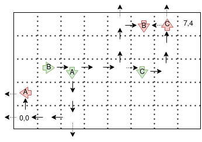

# Mars Rover Challenge
A Python implementation of the [Mars Rover](https://code.google.com/archive/p/marsrovertechchallenge/)
coding challenge.

The following additional rules have been applied to the problem described
at the above URL:
- A rover should ignore any instruction which would cause it to move
  beyond the edge of the plateau.
- A rover may not move to a position already occupied by another rover
  and should ignore any instruction to do so.

For example, consider the following scenario:

This is described by the input:

    7 4
    2 2 S
    MMMRMMMRMLM
    1 2 E
    MMMMLMMMRMR
    5 2 S
    LMLMMLMRM

In this scenario, we see that the first rover, A, receives several instructions
to move off the edge of the plateau, but ignores these and continues with its
subsequent instructions. The second rover, B, moves over the cell initially
occupied by A, but this is okay since that cell has already been vacated.
However, B cannot move onto the cell initially occupied by the third rover,
C, as C has not yet moved from its initial position. B similarly has a close
encounter with a plateau edge, while C, in its turn, narrowly avoids both a
collision with B and a tumble off the precipice.

The final state in this example is thus:

    0 1 W
    5 4 S
    6 4 N

## Setup
The program requires Python 3.8 or above.

In the project root directory, create a Python virtual environment:

    python3.8 -m venv .venv

Activate the virtual environment:

    source .venv/bin/activate

Install the `marsmission` package and optional unit testing dependencies:

    pip install -e .[test]

## Test
Two hand-crafted test cases are included which verify the correctness
of the program output for a given input. The first is that described
at the above URL; the second is the example shown above.

The [Hypothesis](https://hypothesis.readthedocs.io/en/latest/) testing
framework is additionally used to generate a large number of randomized
mission scenarios. In each case, printouts are provided of generated input
and resulting output, and basic validation of the final state is performed.

With the virtual environment activated, the tests may be run by typing:

    pytest -s

## Run
With the virtual environment activated, the program may be run as follows,
with input concatenated from file(s) listed on the command line:

    python -m marsrover example_1

If no files are provided, input is read from `stdin`. This may be supplied
interactively, with input terminated by a semicolon on a new line:

    python -m marsrover

Alternatively, `stdin` may be redirected from a file:

    python -m marsrover < example_2

## Notes
Cardinal direction has been implemented as an enumeration, with the value
associated with each direction name being the corresponding unit vector.

This simplifies the calculation of a rover's next state: a move can be
executed simply by adding the value of the rover's current direction to
its current position, and a turn can be executed simply by applying a 2x2
rotation matrix to the current heading, and selecting the direction that
corresponds with the result.
